<div align="center">

<a href="https://gotardon1.github.io/GotardoN1/">
  <picture>
    <source media="(prefers-color-scheme: dark)" srcset="assets/cabecalho-dark.svg">
    
  </picture>
</a>

<a href="https://gotardon1.github.io/GotardoN1/"></a>
<a href="https://www.linkedin.com/in/matheus-gotardo-680b3232b"></a>
<a href="mailto:luh20123@gmail.com"></a>

**[Sobre](#sobre-mim)** · **[Projetos](#projetos)** · **[Stack](#stack)** · **[Atividade](#atividade)** · **[Contato](#contato)**

</div>

<picture><source media="(prefers-color-scheme: dark)" srcset="assets/divisoria-dark.svg"></picture>

## Sobre mim

Trabalho com **infraestrutura, dados e automação**. Gosto de pegar um processo manual e transformá-lo num sistema simples de usar, que roda sozinho e avisa quando algo sai do lugar.

```yaml
nome:       Matheus Gotardo
formação:   Bacharelado em Ciência da Computação (UNIANDRADE)
foco:       [infraestrutura, redes, dados & BI, automação]
hoje:       intranet corporativa, apps desktop e acesso remoto em produção
```

<details>
<summary><b>👉 Clique para ver como eu costumo trabalhar</b></summary>
<br>

| Etapa | O que eu faço |
|---|---|
| **1. Entender** | Converso com quem usa o processo e anoto onde está o retrabalho. |
| **2. Construir** | Começo pelo mínimo que resolve, com testes e documentação em português. |
| **3. Publicar** | Entrega automática pelo GitHub (CI → produção), sempre com nota de versão. |
| **4. Acompanhar** | Monitoramento, backup e atualização automática para ninguém ficar parado. |

</details>

<picture><source media="(prefers-color-scheme: dark)" srcset="assets/divisoria-dark.svg"></picture>

## Projetos

> Clique em cada projeto para abrir os detalhes. No [portfólio interativo](https://gotardon1.github.io/GotardoN1/#projetos) dá para filtrar por área e buscar.

### 🏢 Em produção

Sistemas usados todos os dias numa rede de lojas de varejo. O código é privado, então aqui vai só o resumo.

<details>
<summary><b>🧭 Intranet corporativa</b> · portal interno completo · <code>React</code> <code>TypeScript</code> <code>Node.js</code> <code>PostgreSQL</code> <code>Docker</code></summary>
<br>

Portal interno que reúne o dia a dia da empresa num só lugar.

- **Central de serviços**: chamados com SLA, aprovações e filas por setor (TI, Logística, Marketing).
- **Comunicação**: informativos integrados ao Google Drive, com leitura obrigatória, agenda, salas e aniversariantes.
- **Gestão de TI**: controle de ativos e licenças, monitoramento das lojas e área de manutenção com backup.
- **Acesso**: 4 perfis de permissão e login Google restrito ao domínio da empresa.
- **Entrega**: CI no GitHub Actions publica sozinho numa VM Proxmox; 180+ testes automatizados.

</details>

<details>
<summary><b>🏷️ Etiquetas de estoque</b> · app desktop · <code>Electron</code> <code>ZPL</code> <code>Google Drive</code></summary>
<br>

Juntou quatro ferramentas antigas do estoque num único aplicativo.

- Etiquetas em **ZPL** para impressoras Zebra, com **detecção automática** do modelo e calibração por régua.
- Folhas A4 de transporte em PDF, uma por volume.
- Cadastros de lojas e transportadoras lidos do **Google Drive**.
- **Atualização automática** e duas versões: Windows 10/11 e Windows 7/8/8.1.

</details>

<details>
<summary><b>🖥️ Acesso remoto</b> · suporte às lojas · <code>Electron</code> <code>RustDesk</code> <code>PowerShell</code></summary>
<br>

Cliente de suporte remoto sobre um servidor RustDesk próprio, no estilo TeamViewer.

- Lista de lojas e computadores organizada pelos grupos do servidor.
- **Instala e configura o RustDesk sozinho** no computador do usuário.
- Indicador do **status do servidor** em tempo real (verde, amarelo ou vermelho).
- Atualização automática pelo GitHub Releases.

</details>

### 💻 Software e web

<details>
<summary><b>🎧 G435 Companion</b> · painel para o headset Logitech G435 · <code>C#</code> <code>WinForms</code> <code>Core Audio</code></summary>
<br>

Painel independente, em português, para o Logitech G435 no Windows. Reúne volume, mute do microfone, tipo de conexão (USB/LIGHTSPEED ou Bluetooth) e bateria numa janela com animações que reagem ao uso.

Ele mostra apenas o que o Windows consegue informar. Quando um dado não existe, o painel avisa em vez de inventar um valor. Também se atualiza pelo GitHub Releases.

**[Ver repositório →](https://github.com/GotardoN1/G435-Companion)**

</details>

<details>
<summary><b>📊 PlaneX</b> · site de automação de planilhas · <code>HTML</code> <code>CSS</code> <code>JavaScript</code></summary>
<br>

Site de serviço para automatizar planilhas de Excel e Google Sheets. Tem uma **demonstração interativa** que mostra uma planilha manual virando relatório automático.

**[Abrir site →](https://gotardon1.github.io/PlaneX/)** · **[Repositório](https://github.com/GotardoN1/PlaneX)**

</details>

<details>
<summary><b>🎮 MSEC TEAM</b> · site de equipe de esports · <code>TypeScript</code> <code>React</code></summary>
<br>

Site da equipe **Me Sinto em Casa Esports**.

**[Abrir site →](https://gotardon1.github.io/msecteam-site/)** · **[Repositório](https://github.com/GotardoN1/msecteam-site)**

</details>

### 📈 Dados e BI

<details>
<summary><b>☀️ BI aplicado à eficiência energética</b> · <code>MySQL</code> <code>Star Schema</code> <code>Power BI</code></summary>
<br>

Análise da viabilidade de energia solar fotovoltaica numa planta industrial em Salvador/BA. Data warehouse em **MySQL** com **esquema estrela**, ETL em SQL e dashboards em **Power BI** (cubo OLAP).

**[Ver repositório →](https://github.com/GotardoN1/Business-Intelligence-aplicado-Efici-ncia-Energ-tica)**

</details>

<details>
<summary><b>🌱 Sustentabilidade energética e RECs</b> · <code>Engenharia de dados</code> <code>BI</code></summary>
<br>

Estudo do consumo de energia e da adoção de **Certificados de Energia Renovável (RECs)**. Usa modelagem de dados e BI para apoiar decisões sustentáveis.

**[Ver repositório →](https://github.com/GotardoN1/Sustentabilidade-Energ-tica-e-An-lise-de-REC-s)**

</details>

<details>
<summary><b>📏 Trena digital com Machine Learning</b> · <code>Python</code> <code>SVM</code> <code>UX</code></summary>
<br>

Proposta de trena eletrônica que usa **SVM** para reconhecer medidas escritas à mão e transformá-las em dados digitais. Assim, o profissional não precisa redigitar as medidas no relatório.

**[Ver repositório →](https://github.com/GotardoN1/trena-digital-ux-ml)**

</details>

<details>
<summary><b>🏗️ Medição e orçamento de obras com OCR</b> · <code>Python</code> <code>OCR</code> <code>SINAPI</code></summary>
<br>

Aplicação desktop para pequenas construtoras e autônomos. Ela lê com **OCR** as medições anotadas em caderno e gera relatórios e orçamentos com base na tabela **SINAPI**.

**[Sistema →](https://github.com/GotardoN1/Sistema-de-Medi-o-e-Or-amento-de-Obras-com-OCR)** · **[Estudo e apresentação](https://github.com/GotardoN1/Aplica-o-Desktop-de-Medi-o-e-Or-amento-de-Obras-com-OCR)**

</details>

### 🌐 Infraestrutura e estudos

<details>
<summary><b>🛒 Rede do Supermercado Colina</b> · <code>Cisco Packet Tracer</code> <code>LAN</code> <code>IoT</code></summary>
<br>

Planejamento e simulação da rede completa de uma rede de supermercados fictícia em Curitiba. São três unidades interligadas, com LAN e dispositivos IoT.

**[Ver repositório →](https://github.com/GotardoN1/projeto-redes-cisco-packet-tracer)**

</details>

<details>
<summary><b>🕸️ Grafo Social</b> · <code>Python</code> <code>Teoria dos grafos</code></summary>
<br>

Estudo de como a teoria dos grafos sustenta o Facebook: da modelagem matemática a tecnologias de backend como **TAO** e **GraphQL**.

**[Ver repositório →](https://github.com/GotardoN1/Grafo-Social)**

</details>

<details>
<summary><b>🏓 Pong no Open 3D Engine</b> · <code>O3DE</code> · em equipe</summary>
<br>

Estudo do motor open source **O3DE** (Linux Foundation) com a implementação de um Pong. Feito com Fabrício Corrêa e Nicole Diniz.

**[Ver repositório →](https://github.com/GotardoN1/Open-3D-Engine-O3DE-Project---Pong-Implementation)**

</details>

<details>
<summary><b>🧠 Repita a Sequência</b> · <code>C</code> · jogo de memória</summary>
<br>

Jogo de memória para crianças de 9 a 12 anos, com sequências de cores e sons. Passou por planejamento, requisitos, fluxograma e implementação em **C**.

**[Ver repositório →](https://github.com/GotardoN1/Jogo-Recreativo-Repita-a-Sequ-ncia)**

</details>

<picture><source media="(prefers-color-scheme: dark)" srcset="assets/divisoria-dark.svg"></picture>

## Stack

<div align="center">

**Linguagens e web**<br><br>


**Dados, infraestrutura e automação**<br><br>


<br>


</div>

#### Onde eu uso cada coisa

| Área | Ferramentas | Exemplo |
|---|---|---|
| Infraestrutura | Proxmox, Linux, Docker, pfSense | VMs de produção com deploy automático |
| Redes | Cisco, NAT, monitoramento | Status e operadora de link de cada loja num painel Grafana |
| Dados & BI | PostgreSQL, MySQL, Power BI | Data warehouse em esquema estrela |
| Automação | PowerShell, Node.js, GitHub Actions | Instalação e atualização sem intervenção |
| Software | TypeScript, React, Electron, C#, Python | Intranet, apps desktop, OCR |

<picture><source media="(prefers-color-scheme: dark)" srcset="assets/divisoria-dark.svg"></picture>

## Atividade

<div align="center">


<br><br>

<a href="https://github.com/GotardoN1">
  <picture>
    <source media="(prefers-color-scheme: dark)" srcset="https://streak-stats.demolab.com/?user=GotardoN1&locale=pt_BR&hide_border=true&background=161b22&ring=2dd4bf&fire=f5b84b&currStreakNum=e6edf3&sideNums=e6edf3&currStreakLabel=2dd4bf&sideLabels=8b949e&dates=8b949e&stroke=30363d">
    
  </picture>
</a>

<br><br>

<picture>
  <source media="(prefers-color-scheme: dark)" srcset="output/github-snake-dark.svg">
  
</picture>

</div>

<picture><source media="(prefers-color-scheme: dark)" srcset="assets/divisoria-dark.svg"></picture>

## Contato

<div align="center">

Tem um processo manual que poderia rodar sozinho? Vamos conversar.

<a href="https://www.linkedin.com/in/matheus-gotardo-680b3232b"></a>
<a href="mailto:luh20123@gmail.com"></a>
<a href="https://gotardon1.github.io/GotardoN1/"></a>

</div>
